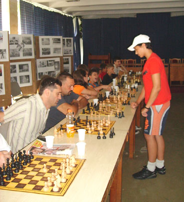
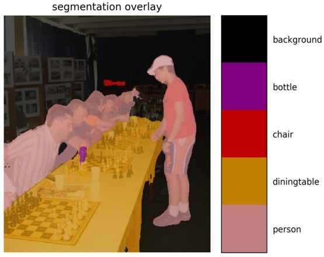

# vision4j-collection
Collection of computer vision models, ready to be included in a JVM project. The idea is to maintain
a list of implementations for different computer vision problems in a plug-and-play format.

## Table of Contents
- [Problems](#problems)
  - [Classification](#classification)
    - [Pretrained VGG16 on ImageNet using DeepLearning4j](#pretrained-vgg16-on-imagenet-using-deeplearning4j)
    - [GRPC classifier](#grpc-classifier)

  - [Segmentation](#segmentation)
    - [GRPC segmentation](#grpc-segmentation)


## Problems


### Classification

By a given image, find the category that the image belongs to. For example, if a model is trained to recognize
the categories: `lion`, `cheetah` and `tiger`, when given an image in one of those categories, it can recognize it.

| Input        | Output
| ------------- |:-------------:|
|  | lion
|  | cheetah
|  | tiger


Implementations available for this problem:

#### Pretrained VGG16 on ImageNet using DeepLearning4j

Trained on the [ImageNet](www.image-net.org/) dataset.

To use this implementation in your project, add the dependency:
```xml
<dependency>
    <groupId>com.vision4j</groupId>
    <artifactId>vgg16-deeplearning4j-classifier</artifactId>
    <version>1.2.0</version>
</dependency>
```

This implementation uses [ND4J](https://nd4j.org/), so you should add one more dependency depending on whether
you have GPU or not. You can read more about it [here](https://nd4j.org/getstarted).


Once you have added the dependency, you can use it like this:

```java
ImageClassifier imageClassifier = new Vgg16DeepLearning4jClassifier();
Category category = imageClassifier.predict(new File("./cheetah.jpg"));
String name = category.getCategoryName(); // cheetah
int index = category.getIndex(); // 293
```

Minimum required memory for the model: 1.355 GB

Prediction times (in seconds):

| 1080Ti  | K80  | CPU (AMD Ryzen)
| ------------- |:-------------:|:-------------:|
| 0.070 | TODO | 0.730

#### GRPC classifier

Delegates to another classifier (in another languages) through GRPC call.

To use this implementation in your project, add the dependency:
```xml
<dependency>
    <groupId>com.vision4j</groupId>
    <artifactId>grpc-classifier</artifactId>
    <version>1.2.0</version>
</dependency>
```

This implementation requires a GRPC server running with the classifier. You can use any C++, Python or Lua model. By default, it communicates over localhost on port 50051 and is usually faster than the corresponding DeepLearning4j implementation.
You can read more about GRPC [here](https://grpc.io/).
For example, one possible implementation for GPU would be:

```bash
nvidia-docker run -it -p 50051:50051 vision4j/grpc-keras-vgg16-classification:gpu
```

 If you don't have a GPU, run the following:

```bash
docker run -it -p 50051:50051 vision4j/grpc-keras-vgg16-classification
```

Once you have added the dependency, you can use it like this:

```java
ImageClassifier imageClassifier = new GrpcClassifier();
Category category = imageClassifier.predict(new File("./cheetah.jpg"));
String name = category.getCategoryName(); // cheetah
int index = category.getIndex(); // 293
```

Minimum required memory for the model: Depends on the model server

Prediction times (in seconds):

| 1080Ti  | K80  | CPU (AMD Ryzen)
| ------------- |:-------------:|:-------------:|
| 0.032 | TODO | TODO


### Segmentation

By a given image, for each pixel predict what it is. For example, if a model is trained to recognize
`person`, `table` and `bottle`, when given an image, it is able to correctly predict the boundaries of every category of objects.

| Input        | Output
| ------------- |:-------------:|
|  | 


Implementations available for this problem:

#### GRPC segmentation

Delegates to another segmentation model (in another languages) through GRPC call.

To use this implementation in your project, add the dependency:
```xml
<dependency>
    <groupId>com.vision4j</groupId>
    <artifactId>grpc-segmentation</artifactId>
    <version>1.0.0</version>
</dependency>
```

This implementation requires a GRPC segmentation server. You can use any C++, Python or Lua model. By default, it communicates over localhost on port 50052 and is usually faster than the corresponding DeepLearning4j implementation.
You can read more about GRPC [here](https://grpc.io/).
For example, one possible implementation for GPU would be:

```bash
nvidia-docker run -it -p 50051:50051 vision4j/deeplabv3-pascal-voc-segmentation:gpu
```

 If you don't have a GPU, run the following:

```bash
docker run -it -p 50051:50051 vision4j/deeplabv3-pascal-voc-segmentation
```

Once you have added the dependency, you can use it like this:

```java
Segmentation segmentation = new PascalVOC2012GrpcSegmentation();
SegmentationResult segmentationResult = segmentation.segment(new File("./seans.jpg"));
BufferedImage resultImage = segmentationResult.getBufferedImage();
```

Minimum required memory for the model: Depends on the model server

Prediction times (in seconds):

| 1080Ti  | K80  | CPU (AMD Ryzen)
| ------------- |:-------------:|:-------------:|
| TODO | TODO | TODO


